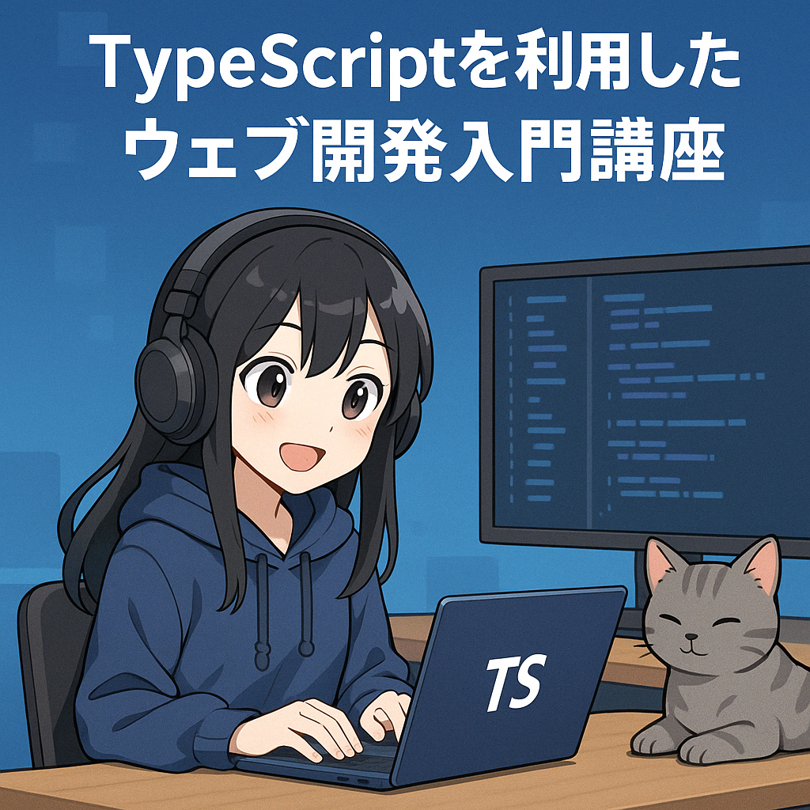

  

## 対象

- RICORA の新入生（Web 未経験〜触り始めた程度）

## ゴール

- HTML → CSS → JavaScript → TypeScript の流れで To‑Do リストを完成させる

## 事前準備

- Node.js 22 以上
- Git
- VS Code (+ 推奨拡張機能: Biome.js, Pretty TypeScript Errors)
- Google Chrome

## セッション概要

| 時間      | セッション           |
| --------- | -------------------- |
| 0:00–0:05 | オープニング         |
| 0:05–0:15 | 環境セットアップ     |
| 0:15–0:25 | HTML 基礎            |
| 0:25–0:35 | CSS 入門             |
| 0:35–0:45 | JavaScript 超入門    |
| 0:45–0:55 | TypeScript 入門      |
| 0:55–1:10 | 実装 ①「タスク追加」 |
| 1:10–1:25 | 実装 ②「完了・削除」 |
| 1:25–1:30 | まとめ & Q&A         |

詳細は [docs/agenda.md](docs/agenda.md) を参照してください。
