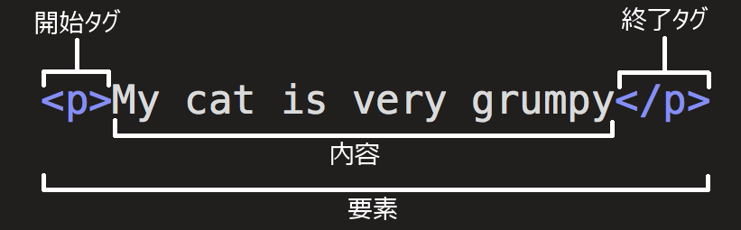

# Vite × TypeScript で作る

## シンプル To‑Do アプリ

**所要時間:** 90  分  
**対象:** Web 開発初心者 / RICORA 新入生

<QRCode
  type="svg"
  data="https://r4ai.github.io/hello-web/slides/"
  :width="140"
  :height="140"
  style="background: white; padding: 8px; width: fit-content; border-radius: 8px; position: absolute; top: 20px; right: 20px;"
/>

---
layout: iframe-right
url: https://r4ai.github.io/hello-web/app/
---

## 完成デモ

本講座で作成するアプリのデモ：


<QRCode
  type="svg"
  data="https://r4ai.github.io/hello-web/app/"
  :width="100"
  :height="100"
  style="background: white; padding: 8px; width: fit-content; border-radius: 8px;"
/>

https://r4ai.github.io/hello-web/app/

---
layout: center
---

## 本日のゴール

1. **Vite** で開発環境を構築できるようになる
2. **HTML → CSS → TypeScript** の流れで Web 開発（フロントエンド）の基礎を理解
3. ブラウザだけで動く **To‑Do アプリ** を完成させる

---

## アジェンダ (90  分)

| 時間      | セッション                     |
| --------- | ------------------------------ |
| 0:00‑0:05 | オープニング & ゴール共有      |
| 0:05‑0:15 | HTML 基礎                      |
| 0:15‑0:20 | CSS 入門                       |
| 0:20‑0:45 | TypeScript 入門                |
| 0:45‑1:15 | 実装                           |
| 1:15-1:30 | まとめ & Q&A                   |

---

## 事前準備チェック ✅

以下の環境が整っているか確認してください

- GitHub アカウント
- ブラウザ（Chrome, Edge, Firefox, ...）

---
layout: section
---

# HTML入門

この世のすべての Web ページは HTML でできている

---

## HTML入門

HTML は、Web ページの構造を定義するための言語

<iframe class="h-[380px] w-full" scrolling="no" title="Untitled" src="https://codepen.io/r4ai/embed/GggOBzO?default-tab=html%2Cresult&editable=true" frameborder="no" loading="lazy" allowtransparency="true" allowfullscreen="true">
</iframe>

---

## HTML 基礎

HTMl要素の構成について

- HTML 要素は `<要素名>内容</要素名>` で表す
- `<要素名>` で開始タグを、`</要素名>` で終了タグを表す

<figure class="w-[60%] mx-auto mt-6">
  
  <figcaption class="text-center text-sm mt-2">
    出典：<a href="https://developer.mozilla.org/ja/docs/Learn_web_development/Core/Structuring_content/Basic_HTML_syntax">MDN Web Docs「基本的な HTML の構文」</a>
  </figcaption>
</figure>

---

## HTML 基礎

クラスと ID 属性について

- **クラス**：`<要素名 class="クラス名">`

  - 複数の要素に同じスタイルを適用するために使用

  - 例：

    ```html
    <div class="todo-item">タスク1</div>
    <div class="todo-item">タスク2</div>
    ```

- **ID**：`<要素名 id="ID名">`

  - ページ内で一意の要素を識別するために使用（複数の要素に同じ ID は NG）

  - 例：

    ```html
    <div id="todo-item-1">タスク1</div>
    <div id="todo-item-2">タスク2</div>
    ```

---

## HTML 基礎 / よく使う要素一覧

- `<h1>` 〜 `<h6>`：見出し

  ```html
  <h1>見出し1</h1>
  <h2>見出し2</h2>
  ```

- `<p>`：段落

  ```html
  <p>段落</p>
  ```

- `<div>`：汎用コンテナ

  ```html
  <div>特に意味を持たない要素</div>
  ```

- `<ul>`, `<li>`：順序なしリスト, リスト項目

  ```html
  <ul>
    <li>リスト項目1</li>
    <li>リスト項目2</li>
  </ul>
  ```

---

## HTML 基礎 / よく使う要素一覧

- `<button>`：ボタン

  ```html
  <button type="button">ボタン</button>
  ```

- `<input>`：入力フィールド

  ```html
  <input type="text" placeholder="入力してください">
  ```

- `<form>`：フォーム

  ```html
  <form id="todo-form">
    <input type="text" id="todo-input" placeholder="タスクを追加">
    <button type="submit">追加</button>
  </form>
  ```

---
layout: section
---

# CSS 入門

全ての Web ページのデザインは CSS で記述されている

---

## CSS 入門

全ての Web ページのデザインは CSS で記述されている

- CSS は、Web ページのデザインを制御するための言語
- ⇒ HTML で構造を作ったら、 CSS で見た目を整える

<iframe class="h-[300px] w-full my-6" scrolling="no" title="CSS" src="https://codepen.io/r4ai/embed/bNNYxay?default-tab=css%2Cresult&editable=true" frameborder="no" loading="lazy" allowtransparency="true" allowfullscreen="true">
</iframe>

---
layout: section
---

# TypeScript 入門

ブラウザで動く唯一のプログラミング言語

---

## TypeScript 入門


- **JavaScript (JS)** は、ブラウザで動く唯一のプログラミング言語

  - JavaScript は、Web ページにロジックを追加するための言語
  - HTML で構造を作り、 CSS で見た目を整えたら、 JavaScript で動きを追加する
  - 例：ボタンをクリックしたら、商品がカートに追加される \
    　　（クリック時の処理を JavaScript で記述する）

---

## TypeScript 入門

- **TypeScript (TS)** は、 JavaScript のスーパーセット（JavaScriptで出来ることはTypeScriptでも出来る）

  - JavaScript に型を追加した言語
    - 型検査以外の機能は提供しない（と思って支障ない）
    - ⇒ 型の関する記述を全部消せば JavaScript として動く（実行時の動作に影響を与えない）
    - ⇒ Compiler というよりは Linter のような役割を果たす
  - 型を追加することで、コードの可読性や保守性が向上する
  - 本講義では TypeScript を使用するが、難しい独自機能はほぼ使用しない
    - ⇒ ほぼ JavaScript だと思ってもらって OK

<br>

```ts twoslash
let fruit: "apple" | "banana"; // fruit には "apple" または "banana" のみ代入可能
fruit = "apple";  // OK
fruit = "orange"; // NG
```

---

## TypeScript 入門

変数の宣言

- `let`：再代入可能な変数を宣言する

```ts {monaco-run}
let name = "Alice";
name = "Bob"; // 再代入可能
```

- `const`：再代入不可能な変数を宣言する

```ts {monaco-run}
const age = 25;
age = 30; // エラー: 再代入不可
```

---

## TypeScript 入門

型

- TypeScript では、変数や関数の引数に型を指定することができる

  - `string`：文字列型
  - `number`：数値型
  - `boolean`：真偽値型

```ts {monaco-run}
let name: string = "Alice"; // 文字列型
let age: number = 25; // 数値型
let isStudent: boolean = true; // 真偽値型

name = 123;    // エラー: 型 'number' を 'string' に割り当てることはできません
age = "25";    // エラー: 型 'string' を 'number' に割り当てることはできません
isStudent = 1; // エラー: 型 'number' を 'boolean' に割り当てることはできません
```

---

## TypeScript 入門

関数の定義

- `(引数1, 引数2, ...) => { 処理 }` で関数を定義する

```ts {monaco-run}
const greet = (name: string) => {
  console.log(`Hello, ${name}!`);
};

greet("Alice"); // Hello, Alice!
```

---

## TypeScript 入門

制御フロー

- `if` 文で条件分岐を行う

```ts {monaco-run}
const age = 20;
if (age >= 18) {
  console.log("成人です");
} else {
  console.log("未成年です");
}
```

- `for` 文でループ処理を行う

```ts {monaco-run}
for (let i = 0; i < 3; i++) {
  console.log(i);
}
```

---

## TypeScript 入門

配列

- 配列は `[]` で定義し、要素を格納する

```ts {monaco-run}
const fruits = ["apple", "banana", "orange"];
console.log(fruits[0]); // apple
console.log(fruits.length); // 3

fruits.push("grape"); // 要素追加
console.log(fruits); // ["apple", "banana", "orange", "grape"]

fruits.pop(); // 要素削除
console.log(fruits); // ["apple", "banana", "orange"]
```

---

## TypeScript 入門

オブジェクト

- オブジェクトは `{}` で定義し、プロパティを格納する

```ts {monaco-run}
type Person = {
  name: string;
  age: number;
}

const person: Person = {
  name: "Alice",
  age: 25,
};

console.log(person.name); // Alice
console.log(person.age); // 25
```

---

## 実装 ①

タスク一覧の表示

<<< ./snippets/step1.ts#step1

---

## 実装 ②

タスク追加機能

<<< ./snippets/step2.ts#step2

---

## 実装 ③

タスク削除機能

<<< ./snippets/step3.ts#step3-1

---

## 実装 ③

タスク削除機能

<<< ./snippets/step3.ts#step3-2


---

## 実装 ④ (発展)

データの永続化（LocalStorage）

- **ヒント**：LocalStorage を使用して、タスクを保存・読み込みを行う例

  ```ts twoslash
  type Todo = {
    id: number;
    text: string;
    completed: boolean;
  };
  let todos: Todo[] = [];

  // ---cut-before---
  // save
  localStorage.setItem("todos", JSON.stringify(todos));

  // load
  todos = JSON.parse(localStorage.getItem("todos") ?? "[]");
  ```

---

## 振り返り

本講義で学んだこと

- **Vite** を使用した開発環境の構築
- **HTML** の基本的な構造と要素
- **CSS** を使用したスタイリング
- **TypeScript** の基本的な文法
- **TypeScript** を使用した簡単なToDoアプリケーションの実装

ロードマップ：https://roadmap.sh/frontend

👆 Web開発に必要な知識と、学ぶべき順番が示されている

---

## 今後の発展

最小限のアプリから実用的なアプリへ

- **フロントエンド領域**：
  - **React** / **Solid** / **Svelte** などのUIライブラリを用いて、宣言的な実装手法を学ぶ
  - **Next.js** / **Solid Start** / **Svelte Kit** などを用いて、フルスタック開発を行う
  - **Vitest** などを用いて、テスト駆動開発を行う
  - **Tailwind CSS** などを用いて、スタイリングを効率化する
  - **GitHub Actions** などを用いて、CI/CD を実現する
- **バックエンド領域**：
  - **Hono** などを用いて、REST API 開発を行う
  - **PostgreSQL**, **Prisma** などを用いて、データベースを扱う

---

## よくある質問

- Q. 何からやれば良いかわからない

  - A. 自分の作りたいアプリ等があれば、AI等に相談しながらそれを作ってみるのが良いと思います。アプリ開発に必要な知識は全体像は、[Frontend Developer Roadmap | roadmap.sh](https://roadmap.sh/frontend) や [100+ Web Development Things you Should Know | Fireship (YouTube)](https://www.youtube.com/watch?v=erEgovG9WBs) を参考にすると良いと思います。

- Q. 本は買った方がいいですか？

  - A. インターネット上に素晴らしい教材がたくさんあるので、わざわざ本を買う必要はあまりないと思います。特にウェブ関連の技術は移り変わりが激しく、本で紹介されている情報はもう古いということが多々あります。最近はAIが大分賢いので、ChatGPTのo3やClaude 3.7 Sonnetなどに相談するのも良いと思います。

---

# 参考資料

本講義で参考にした & 今後の学習に役立つ資料

- [100+ Web Development Things you Should Know | Fireship (YouTube)](https://www.youtube.com/watch?v=erEgovG9WBs)
- [基礎から学ぶ JavaScript 入門 | しまぶーのIT大学 (YouTube)](https://www.youtube.com/watch?v=pnsieVYy72M&list=PLwM1-TnN_NN7-zdRV8YsGUB82VVhfYiWW)
- [サバイバルTypeScript](https://typescriptbook.jp/)
- [The Modern JavaScript Tutorial](https://ja.javascript.info/)
- [JavaScript Primer - 迷わないための入門書](https://jsprimer.net/)
- [開発者向けのウェブ技術 | MDN](https://developer.mozilla.org/ja/docs/Web)

---
layout: center
---

## まとめ

今回の内容を振り返る

- **Vite & Vanilla JS** による簡単な ToDo アプリ開発体験
- **HTML, CSS, TypeScript** の基礎を学ぶ

次の一歩 👉 React / NextJS

---
layout: center
---

# Q & A

<small>Thanks for joining RICORA! \
Slides & Program: <https://github.com/r4ai/hello-web></small>
